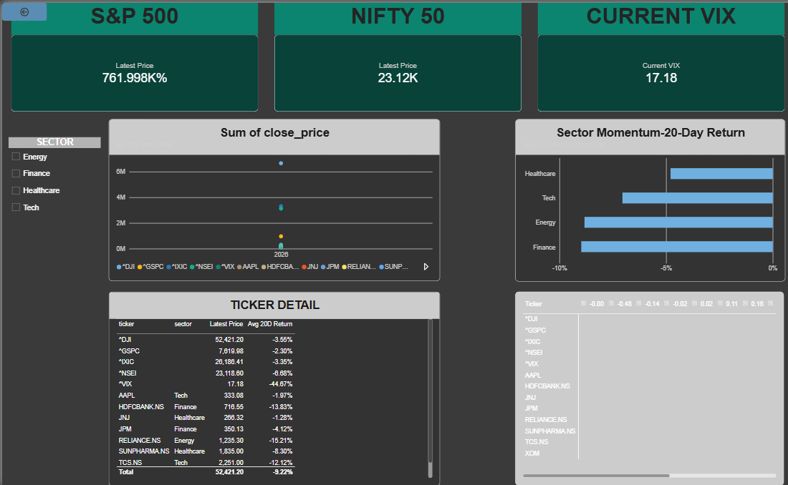

# Market Monitor: Multi-Market Financial Analytics Pipeline

An end-to-end analytics pipeline covering US and Indian equities — built from raw API data
through cleaning, analysis, a MySQL database layer, and an interactive Power BI dashboard.

## Dashboard

## What it does

- Pulls live price data (yfinance) across 13 tickers — major US/India indices + stocks
  across Tech, Finance, Energy, and Healthcare
- Handles real-world data issues: cross-market calendar mismatches (US vs India holidays),
  missing values via forward-fill
- Calculates daily returns, annualized rolling volatility (risk metric)
- Ranks sectors by 20-day momentum
- Computes cross-ticker correlation (found that same-sector stocks in different countries,
  e.g. XOM vs RELIANCE.NS, can be *negatively* correlated — same GICS label ≠ same market exposure)
- Classifies market regime (Calm/Normal/Volatile) using VIX thresholds
- Stores data in a normalized MySQL schema (price_history + ticker_sectors)
- Visualizes everything in an interactive Power BI dashboard with DAX measures

## Tech stack

Python (pandas, yfinance) · MySQL · Power BI (DAX)

## Setup

1. `pip install -r requirements.txt`
2. Run `sql/schema.sql` in MySQL to create the database
3. Add your MySQL password to a `.env` file: `DB_PASSWORD=yourpassword`
4. Run `notebooks/01_explore_data.ipynb` to pull, clean, analyze, and load data
5. Open `MARKET-MONITOR.pbix` in Power BI

## Key insight

Sector labels can be misleading across markets — two "Energy" stocks (XOM, US and
RELIANCE.NS, India) showed a correlation of roughly -0.23, meaning grouping by GICS
sector alone doesn't guarantee similar market behavior.

## AI-Generated Market Commentary

   The pipeline uses Google's Gemini API to auto-generate a natural-language market
   brief from the computed metrics (sector rankings, regime status) — bridging
   traditional quantitative analysis with an LLM-based narrative layer.
